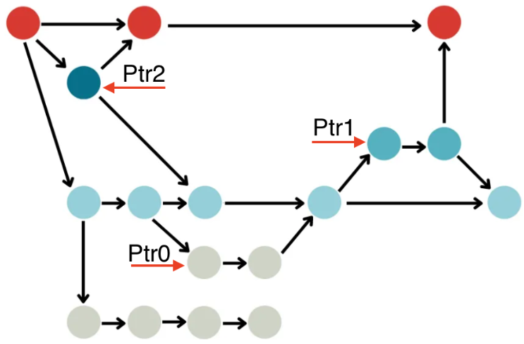
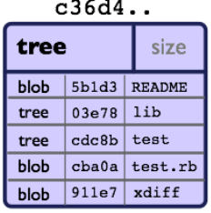
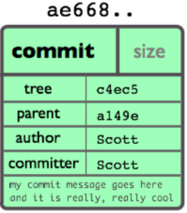

# Git-Internals
Here, I hope you can find valuable information about Git internals and gain insights into its functioning through low-level commands, commonly referred to as Git plumbing commands. 

## Dependencies
Requires [Git](https://git-scm.com/) to be installed and in the `PATH` environment variable. To check that open your terminal and run the following command to check your installed version of Git.

````
    git --version
````
## What is Git?
Almost everyone familiar with Git would describe it as version control software or something similar. However, in this investigation, we will delve into its internal structure. From this perspective, Git can be seen as a collection of `objects` and `pointers` capable of forming graph structures, as depicted in the picture below. These structures are stored in nonvolatile memory.

<p align="center">
    
</p>

As you can see in the picture, we have some `objects` (circles) with the ability to point to other objects, as well as some arrows or `pointers` (ptr1, ptr2, etc.) that can point to these objects. But wait! What is a pointer, and why is it important to us?

In brief, a pointer is essentially a SHA-1 hash of a Git object. It holds significant importance as it appears throughout the Git internal structure, including data fields of certain objects and files such as the one that stores branches.

## Objects and Pointers
Git has three types of objects, namely Blobs, Trees, and Commits. It's worth noting that these objects are represented as files stored within the .git/objects folder. They adhere to a specific naming convention, whereby the name of an object corresponds to the SHA-1 hash of its content. Importantly, this SHA-1 hash serves as a pointer to the respective object. So when you see these SHA-1 hashes you can think of them as simple pointers!

## Blobs
A Blob, abbreviated as Binary Large OBject, is similar to a buffer where raw data can be stored. As the name implies, this Git object lacks any form of metadata, such as timestamps or owner information. Furthermore, it does not possess the ability to point to other objects through SHA-1 hashes. From my perspective, the most effective way to understand a Blob is to envision it as a buffer in which any type of data including text, image, binaries, ... can be stored. The following picture illustrates an imaginary Blob.

<p align="center">
    
</p>

## Trees
Indeed, a Tree in Git is distinct from a Blob. While a Blob serves as a container for raw data, a Tree does not hold any data itself. Instead, it functions as a directory or folder in a file system analogy. A Tree in Git stores a collection of pointers (SHA-1 hashes) to other Blobs and Trees, representing the contents and structure of a directory.
Furthermore, Git offers the capability to assign human-readable names to these pointers. By combining the graph structure formed by Blobs and Trees with the use of reference names, Git can function as a highly efficient and versatile file system.

<p align="center">
    
</p>

Additionally, it is worth highlighting that a Tree can serve as a means to store the state of the Git file system by creating a comprehensive list of all existing Blobs and Trees. This crucial role of Trees becomes evident when examining Commit objects, as they rely on Trees to capture snapshots of the file system at specific points in time.

## Commits
Commits serve as objects that capture desired states in Git. As depicted in the following picture, each commit object comprises three distinct types of information:

- A pointer to a tree representing the captured state of the file system.
- A list of pointers to other commit objects, indicating inherited or derived states.
- Metadata, including timestamp, commit messages, authorship details, and more.
  
These components collectively form a comprehensive snapshot of the Git repository at a specific point in time, enabling effective version control and tracking of changes.

<p align="center">
    
</p>

It is crucial to emphasize that in Git, when there are two states where some data, including Blobs and Trees, is identical, there is no need for data replication. This is because any Tree object, including the one used as a snapshot taker in a Commit object, consists of pointers to specific Blobs and other Trees.

However, when even a single bit of information changes in our working directory, Git generates a new Blob with a new unique SHA-1 hash to represent that altered content. Consequently, the content of any Tree object that has a pointer to the modified Blob will be updated, leading to the creation of a new Tree object. This modification also propagates throughout all other Trees that previously pointed to the modified Tree. 

The following picture shows a concrete example in which a new file is added to our working directory. Notably, the Blob associated with the file named class1 is referenced by both commit1 and commit2. However, it is important to observe that despite the shared Blob, there exist two distinct Trees with unique SHA-1 hashes. This distinction in Tree objects occurs due to the alteration in the file system's structure caused by the addition of the new file.

<p align="center">
    
</p>

# Git Exploration

Create a repository named `test` by following the provided high-level instructions, as you can see. This repository should consist of a file named a.txt with the content 'hello', and the commit message should be set as 'commit 1'.

````
    git init test
    echo hello > a.txt
    git add a.txt
    git commit -m "commit 1"
````

Now navigate to the 'test' directory to explore its contents. Inside, you will notice a hidden folder called '.git' containing two significant subfolders: 'objects' and 'refs', along with a file named 'HEAD'. The 'objects' folder serves as a storage location for all Git objects, including blobs, trees, and commits. Conversely, the 'refs' folder stores all the pointers. Additionally, within the 'refs' folder, you will find a subfolder called 'heads', which contains a file named 'main'. Opening this file reveals a 40-digit hexadecimal number, such as '255ef93b6da3b272898b47352853b69e785820e1', which represents the SHA-1 hash of your commit object. This implies that the 'main' file points to that particular commit object.

Returning to the '.git' folder, open the 'HEAD' file. You will observe that its content reads 'ref: refs/heads/main', which refers to the 'main' file. Essentially, 'HEAD' serves as the entry point to our current branch, in this case, 'main'. Therefore, a branch essentially becomes a file, like 'main', that contains a pointer to a commit object.
# Git from Scratch

Having gained a brief understanding of Git's internal structure, let's proceed to create a repository from scratch.
