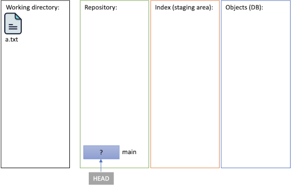

# Git-Internals
Here, I hope you can find valuable information about Git internals and gain insights into its functioning through low-level commands, commonly referred to as Git plumbing commands. 

## Dependencies
Requires [Git](https://git-scm.com/) to be installed and in the `PATH` environment variable. To check that open your terminal and run the following command to check your installed version of Git.

````
    git --version
````
## What is Git?
Almost everyone familiar with Git would describe it as version control software or something similar. However, in this investigation, we will delve into its internal structure. From this perspective, Git can be seen as a collection of `objects` and `pointers` capable of forming graph structures, as depicted in the picture below. These structures are stored in nonvolatile memory.

<p align="center">
    
</p>

As depicted in the diagram, there are several objects represented by circles, which have the capability to point to other objects through black arrows. Additionally, there are red arrows (ptr1, ptr2, etc.) that can be dynamically created. These red and black arrows are referred to as pointers, which play a crucial role in the internal structure of Git. In essence, a pointer is a SHA-1 hash of a Git object.

## Objects and Pointers
Git has three types of objects, namely Blobs, Trees, and Commits. It's worth noting that these objects are represented as files stored within the `.git/objects` folder. They adhere to a specific naming convention, whereby the name of an object corresponds to the SHA-1 hash of its content. Importantly, this SHA-1 hash serves as a pointer to the respective object. So when you see these SHA-1 hashes you can think of them as simple pointers!

## Blobs
A Blob, abbreviated as Binary Large OBject, is similar to a buffer where raw data can be stored. As the name implies, this Git object lacks any form of metadata, such as timestamps or owner information. Furthermore, it does not possess the ability to point to other objects through SHA-1 hashes. From my perspective, the most effective way to understand a Blob is to envision it as a buffer in which any type of data including text, image, binaries, ... can be stored. The following picture illustrates an imaginary Blob.

<p align="center">
    
</p>

## Trees
Indeed, a Tree in Git is distinct from a Blob. While a Blob serves as a container for raw data, a Tree does not hold any data itself. Instead, it functions as a directory or folder in a file system analogy. A Tree in Git stores a collection of pointers (SHA-1 hashes) to other Blobs and Trees, representing the contents and structure of a directory.
Furthermore, Git offers the capability to assign human-readable names to these pointers. By combining the graph structure formed by Blobs and Trees with the use of reference names, Git can function as a highly efficient and versatile file system.

<p align="center">
    
</p>

Additionally, it is worth highlighting that a Tree can serve as a means to store the state of the Git file system by creating a comprehensive list of all existing Blobs and Trees. This crucial role of Trees becomes evident when examining Commit objects, as they rely on Trees to capture snapshots of the file system at specific points in time.

## Commits
Commits serve as objects that capture desired states in Git. As depicted in the following picture, each commit object comprises three distinct types of information:

- A pointer to a tree representing the captured state of the file system.
- A list of pointers to other commit objects, indicating inherited or derived states.
- Metadata, including timestamp, commit messages, authorship details, and more.
  
These components collectively form a comprehensive snapshot of the Git repository at a specific point in time, enabling effective version control and tracking of changes.

<p align="center">
    
</p>

It is crucial to emphasize that in Git, when there are two states where some data, including Blobs and Trees, is identical, there is no need for data replication. This is because any Tree object, including the one used as a snapshot taker in a Commit object, consists of pointers to specific Blobs and other Trees.

However, when even a single bit of information changes in our working directory, Git generates a new Blob with a new unique SHA-1 hash to represent that altered content. Consequently, the content of any Tree object that has a pointer to the modified Blob will be updated, leading to the creation of a new Tree object. This modification also propagates throughout all other Trees that previously pointed to the modified Tree. 

The following picture shows a concrete example in which a new file is added to our working directory. Notably, the Blob associated with the file named class1 is referenced by both commit1 and commit2. However, it is important to observe that despite the shared Blob, there exist two distinct Trees with unique SHA-1 hashes. This distinction in Tree objects occurs due to the alteration in the file system's structure caused by the addition of the new file.

<p align="center">
    
</p>

# Git Exploration

Create a repository named `test` by following the provided high-level instructions, as you can see. This repository should consist of a file named a.txt with the content 'hello', and the commit message should be set as 'commit 1'.

````
    git init test
    echo hello > a.txt
    git add a.txt
    git commit -m "commit 1"
````

Now navigate to the 'test' directory to explore its contents. Inside, you will notice a hidden folder called `.git` containing two significant subfolders: `objects` and `refs`, along with a file named `HEAD`. The 'objects' folder serves as a storage location for all Git objects, including blobs, trees, and commits. Conversely, the 'refs' folder stores all the pointers. Additionally, within the 'refs' folder, you will find a subfolder called `heads`, which contains a file named 'main'. Opening this file reveals a 40-digit hexadecimal number, such as `255ef93b6da3b272898b47352853b69e785820e1`, which represents the SHA-1 hash of your commit object. This implies that the 'main' file points to that particular commit object. To view all the created objects stored within the 'object' folder, you can utilize the following command:
````
    git cat-file --batch-all-objects --batch-check
````
When executing the aforementioned command, the output will resemble the following, with the exception of the commit object. In this example, the content of the blob and tree objects remains identical across different machines worldwide, resulting in the same SHA-1 hashes. However, commit objects incorporate timestamps and distinct metadata, causing the SHA-1 hash numbers to differ on each machine.

````
094ef3623e87f414e1571141c97c7b3444d76ea4 commit 187
2e81171448eb9f2ee3821e3d447aa6b2fe3ddba1 tree 33
ce013625030ba8dba906f756967f9e9ca394464a blob 6
````

To examine the content of each of the aforementioned objects, you can employ the command `git show OBJ_HASH`, where OBJ_HASH represents the SHA-1 hash of the desired object. For instance, when handling the blob object, the output will present the content "hello". Similarly, executing the command will unveil the contents of 'a.txt' for the tree object as it is listed below:
````
> git show ce013625030ba8dba906f756967f9e9ca394464a
hello

> git show 2e81171448eb9f2ee3821e3d447aa6b2fe3ddba1
tree 2e81171448eb9f2ee3821e3d447aa6b2fe3ddba1 
a.txt

````
Returning to the '.git' folder, open the 'HEAD' file. You will observe that its content reads `ref: refs/heads/main`, which refers to the 'main' file. Essentially, 'HEAD' serves as the entry point to our current branch, in this case, 'main'. Therefore, a branch essentially becomes a file, like 'main', that contains a pointer to a commit object. To verify this, you can simply make a copy of the main file and rename it to feature1. Afterward, executing the git log command will reveal the existence of two distinct branches, as illustrated below:
````
> git log
commit 094ef3623e87f414e1571141c97c7b3444d76ea4 (HEAD -> main, feature1)
Author: Ali Ajorian <xxx.yyy@gmail.com>
Date:   Mon Jan 29 08:56:05 2024 +0100

    commit 1

````

To switch from the main branch to feature1, modify the HEAD file and replace its content with `ref: refs/heads/feature1`.

## File Modification

Now, we will proceed to modify the file a.txt and observe the resulting changes. To accomplish this, execute the following commands, which will append the word 'world' to the file a.txt and commit the changes to the repository with the message 'commit 2'.

````
echo world >> a.txt
git add a.txt
git commit -m "commit 2"
````
Now, when you list the objects in the database, you will notice the creation of three new objects, which consist of one blob, one tree, and one new commit. This is reflected in the following section:
````
> git cat-file --batch-all-objects --batch-check
094ef3623e87f414e1571141c97c7b3444d76ea4 commit 187
183dfcf6c5f77a0f5ddaf534bb2ef96e97324513 commit 235
2e81171448eb9f2ee3821e3d447aa6b2fe3ddba1 tree 33
94954abda49de8615a048f8d2e64b5de848e27a1 blob 12
ce013625030ba8dba906f756967f9e9ca394464a blob 6
d4e01edf1e8aa72182ed9449e7d12b5e4df8b201 tree 33
````

Please note that the initial blob, sized at 12 bytes, corresponds to the modified version of a.txt, while the second blob, sized at 6 bytes, represents the first version. You can utilize the git show command to examine their contents. It is important to understand that when you modify a file in your working directory, Git does not directly modify the associated blob object or the tree objects that reference it. Instead, Git generates a new blob (with a new SHA-1 hash) and new tree(s) that utilize this new SHA-1 hash. Therefore, even if you modify just one bit of a significantly large file, Git will generate a new large blob for it while retaining both blobs.


# Git from Scratch

Having gained a brief understanding of Git's internal structure, let's proceed to create a repository from scratch. 
As we saw in the prevois sections, every Git repository consists of a directory named `.git`, which contains two subdirectories: 'objects' and 'refs', used to store Git objects and pointers, respectively. Additionally, it includes a file called 'HEAD', which points to the current branch. To initialize a repository `test`, you can create all of these files and folders using the following commands:
````
mkdir test
cd test
mkdir .git
mkdir .git/objects
mkdir .git/refs
mkdir .git/refs/heads
echo ref: refs/heads/main > .git/HEAD
git status
````
Upon executing the aforementioned commands, an empty repository is created. Now, to proceed further, we can add a file named a.txt with the content 'hello' in our working directory. This is illustrated in the following picture:

<p align="center">
    
</p>


